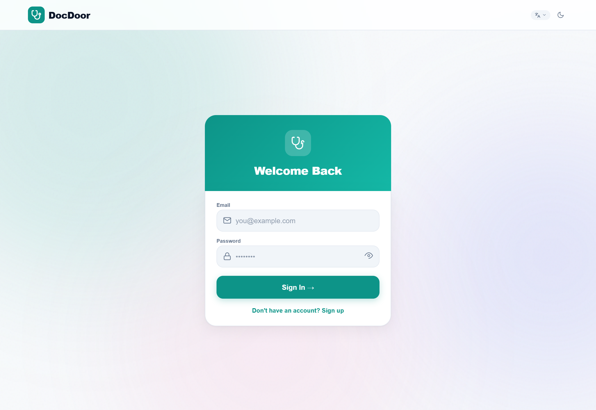
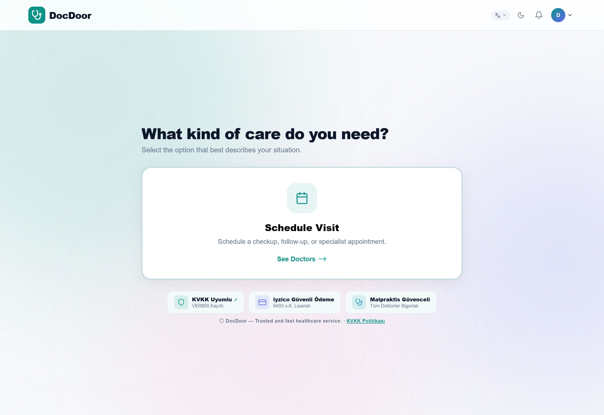
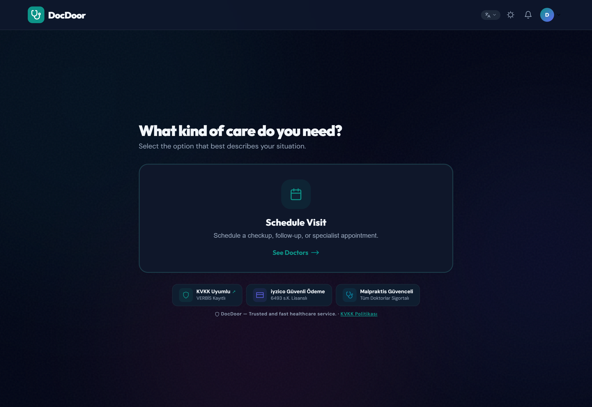

# 🩺 DocDoor — Home-Visit Doctor & Telemedicine Platform

> A full-stack platform that lets patients book on-demand home-visit doctors, manage prescriptions and insurance, pay securely, and receive real-time updates — with an AI health assistant and a full admin back-office.

<p align="left">
  <a href="https://github.com/Dere752/docdoor-backend/actions/workflows/ci.yml">
    
  </a>
  
  
</p>

<p align="left">
  
  
  
  
  
  
  
</p>

---

## 📖 Overview

**DocDoor** ("doctor at your door") is a telemedicine / house-call platform I designed and built end-to-end. A patient can browse verified doctors, book a visit, pay with a card, file an insurance claim, chat with an AI symptom assistant, and follow their appointment status live. Administrators get a complete back-office to manage users, doctors, payments, insurance claims and complaints.

I built the **entire stack myself** — database schema, REST + WebSocket API, authentication, third-party payment & insurance integrations, the React front-end, and a Progressive Web App shell.

---

## 📸 Screenshots

| Sign in | Patient home |
|---------|--------------|
|  |  |

| Dark mode |
|-----------|
|  |

---

## ✨ Key Features

- **🔐 Authentication & Security** — JWT (separate patient/admin secrets), bcrypt password hashing, per-route rate limiting, input sanitization (XSS protection), security headers and an audit log.
- **👨‍⚕️ Doctor Directory & Scheduling** — Browse doctors, view availability, book and track home visits.
- **💊 Prescriptions & Medications** — Manage medications and visit records per patient.
- **💳 Payments (iyzico)** — Pre-authorization on booking → capture after the visit, with a 12-hour full-refund window. Falls back to a **mock provider** when no API key is set, so the project runs out of the box.
- **🏥 Insurance (SGK / Medula + Private)** — Claim eligibility by national ID, automatic coverage-rate and co-pay calculation. Mock mode included.
- **🤖 AI Health Assistant** — Symptom guidance powered by the Anthropic API.
- **🔔 Real-time Notifications** — Live appointment/status updates over a custom **WebSocket** sync layer.
- **🌍 Internationalization** — Full UI in **English, Turkish, Spanish and German**.
- **🛠️ Admin Panel** — Dashboard, user/doctor management, payments, insurance claims, doctor payouts, complaints, system settings and audit trail.
- **📱 PWA** — Installable app with manifest and Lottie animations; JSX is compiled on the fly with Babel.

---

## 🏗️ Architecture

```
                    ┌─────────────────────────────┐
   Browser / PWA ──▶│  Express App  (server.js)   │
   React (app.jsx)  │                             │
        ▲           │  • Security middleware      │
        │  WebSocket │    (rate limit, sanitize,   │
        └────────────┤     headers, JWT auth)      │
   live updates      │  • REST routes (/api/*)     │
                     └──────────────┬──────────────┘
                                    │
        ┌───────────────────────────┼───────────────────────────┐
        ▼                           ▼                           ▼
   SQLite (sql.js)          External integrations         WebSocket Server
   users, doctors,          • iyzico  (payments)          real-time push to
   visits, meds,            • SGK/Medula (insurance)      connected clients
   insurance, payments      • Anthropic (AI assistant)
```

**API modules** (`/routes`): `auth` · `doctors` · `schedule` · `visits` · `meds` · `insurance` · `payment` · `notifications` · `favorites` · `contacts` · `ai` · `admin`

---

## 🚀 Getting Started

```bash
# 1. Clone
git clone https://github.com/Dere752/docdoor-backend.git
cd docdoor-backend

# 2. Install dependencies
npm install

# 3. Configure environment
cp .env.example .env      # then fill in the values (optional — mocks work without keys)

# 4. Run
npm start                 # or: npm run dev  (auto-reload)
```

| URL | Description |
|-----|-------------|
| `http://localhost:3001` | Patient app |
| `http://localhost:3001/admin` | Admin panel |

> **Demo admin (seeded):** `admin@docdoor.com` / `DocDoor2026!` — change it on first login via Admin → Settings.

All third-party integrations (payments, insurance, AI) run in **mock mode** when their API keys are absent, so you can explore the full flow without any external accounts.

---

## ⚙️ Environment Variables

See [`.env.example`](.env.example). Summary:

| Variable | Purpose |
|----------|---------|
| `PORT` | Server port (default `3001`) |
| `JWT_SECRET` / `ADMIN_JWT_SECRET` | Token signing secrets |
| `ANTHROPIC_API_KEY` | AI health assistant |
| `IYZICO_API_KEY` / `IYZICO_SECRET_KEY` / `IYZICO_URI` | Payment provider |
| `MEDULA_API_KEY` / `PRIVATE_INSURANCE_API_KEY` | Insurance providers |

---

## 🧪 Testing & CI

Unit tests run on Node's built-in test runner (zero dependencies):

```bash
npm test
```

Covered today: the **TC Kimlik (national ID) checksum validator** and the **security middleware** (XSS input sanitizer + hardening headers). Every push and pull request is automatically tested on **Node 20 & 22** via **GitHub Actions** ([`.github/workflows/ci.yml`](.github/workflows/ci.yml)).

---

## 🧰 Tech Stack

**Backend:** Node.js · Express · `ws` (WebSocket) · SQLite (`sql.js`) · JWT · bcrypt
**Frontend:** React (Babel-compiled JSX) · PWA · Lottie
**Integrations:** iyzico · SGK/Medula · Anthropic AI

---

## 📄 License

Released under the [MIT License](LICENSE).

---

## 👤 Author

**Ali Dere** — Self-taught full-stack developer
📧 alidere752@gmail.com · 🐙 [github.com/Dere752](https://github.com/Dere752)

<sub>Built as a personal project to learn full-stack engineering by shipping a complete, real-world product.</sub>
